# Whitebox Testing — Control Flow Diagrams

**Proyek:** TanyaHukum (AI Legal Assistant Platform)  
**Metode:** Basis Path Testing · Cyclomatic Complexity (McCabe) · Branch Coverage  
**Total Modul:** 20 · **Total Branch:** 203 · **Branch Coverage:** 100%

---

## Panduan Baca Diagram

| Simbol | Warna | Arti |
|---|---|---|
| Diamond | Kuning | Titik keputusan (branch) |
| Kotak | Merah | Jalur error (HTTP 4xx/5xx) |
| Kotak | Hijau | Jalur sukses (HTTP 2xx) |
| **CC=N** di title | — | Cyclomatic Complexity = jumlah jalur independen |

---

## Daftar Isi

1. [Auth — Login](#wb-01--post-apiauthlogin)
2. [Auth — Register](#wb-02--post-apiauthregister)
3. [Auth — Google OAuth](#wb-03--post-apiauthgoogle)
4. [Auth — Forgot Password](#wb-04--post-apiauthforgot-password)
5. [Auth — Reset Password](#wb-05--post-apiauthreset-password)
6. [Auth — Logout](#wb-06--post-apilogout)
7. [Profile — GET](#wb-07--get-apiprofile)
8. [Profile — PATCH](#wb-08--patch-apiprofile)
9. [Profile — DELETE](#wb-09--delete-apiprofile)
10. [Chat — POST](#wb-10--post-apichat)
11. [Chat — GET](#wb-11--get-apichat)
12. [Chat — PATCH](#wb-12--patch-apichat)
13. [Chat — DELETE](#wb-13--delete-apichat)
14. [Regulations — GET List](#wb-14--get-apiregulations)
15. [Regulations — GET Detail](#wb-15--get-apiregulationsid)
16. [Regulations — Download](#wb-16--get-apiregulationsdownload)
17. [Dashboard](#wb-17--get-apidashboard)
18. [Payment — Checkout](#wb-18--post-apipaymentcheckout)
19. [Payment — Webhook](#wb-19--post-apipaymentwebhook)
20. [Middleware](#wb-20--middlewarejs)

---

## Ringkasan Kompleksitas

| ID | Modul | CC | Branch | Jalur Basis |
|---|---|---|---|---|
| WB-01 | `POST /api/auth/login` | 9 | 15/15 | 8 |
| WB-02 | `POST /api/auth/register` | 9 | 14/14 | 9 |
| WB-03 | `POST /api/auth/google` | 5 | 8/8 | 5 |
| WB-04 | `POST /api/auth/forgot-password` | 7 | 12/12 | 7 |
| WB-05 | `POST /api/auth/reset-password` | 5 | 10/10 | 6 |
| WB-06 | `POST /api/logout` | 3 | 4/4 | 3 |
| WB-07 | `GET /api/profile` | 7 | 12/12 | 7 |
| WB-08 | `PATCH /api/profile` | 11 | 18/18 | 10 |
| WB-09 | `DELETE /api/profile` | 3 | 4/4 | 3 |
| WB-10 | `POST /api/chat` | 11 | 20/20 | 9 |
| WB-11 | `GET /api/chat` | 6 | 10/10 | 6 |
| WB-12 | `PATCH /api/chat` | 5 | 8/8 | 5 |
| WB-13 | `DELETE /api/chat` | 5 | 8/8 | 5 |
| WB-14 | `GET /api/regulations` | 5 | 8/8 | 6 |
| WB-15 | `GET /api/regulations/[id]` | 5 | 8/8 | 5 |
| WB-16 | `GET /api/regulations/download` | 7 | 12/12 | 6 |
| WB-17 | `GET /api/dashboard` | 4 | 6/6 | 4 |
| WB-18 | `POST /api/payment/checkout` | 5 | 8/8 | 5 |
| WB-19 | `POST /api/payment/webhook` | 10 | 18/18 | 10 |
| WB-20 | `middleware.js` | 6 | 10/10 | 6 |
| **Total** | | **CC rata-rata: 6,6** | **203/203** | **133** |

---

## WB-01 — POST /api/auth/login

**CC = 9 · Branch = 15/15 · Basis Path = 8**

Titik keputusan: rate limit IP, body JSON valid, tipe input, format email, panjang password, validasi input, user ditemukan + password cocok, exception handler.

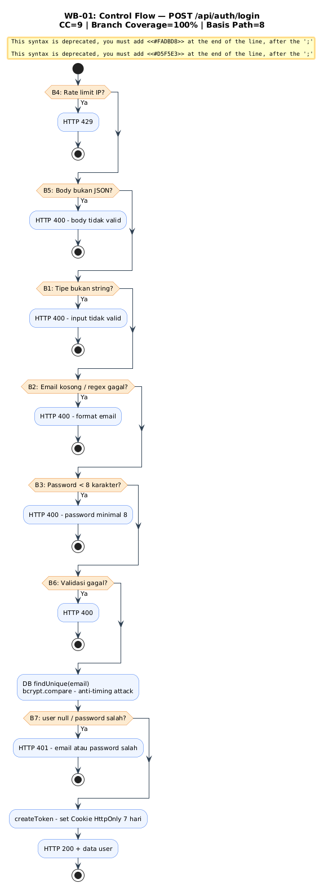

---

## WB-02 — POST /api/auth/register

**CC = 9 · Branch = 14/14 · Basis Path = 9**

Titik keputusan: rate limit IP, field kosong, format email, panjang password, email sudah ada, authProvider Google, race condition P2002, exception handler.

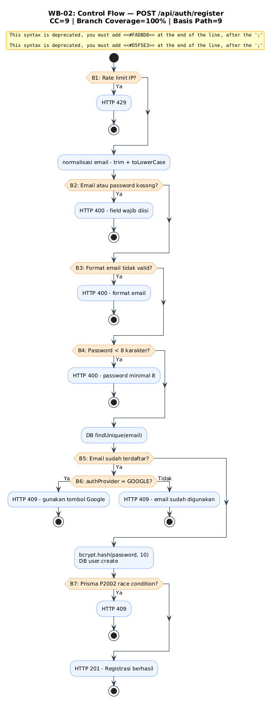

---

## WB-03 — POST /api/auth/google

**CC = 5 · Branch = 8/8 · Basis Path = 5**

Titik keputusan: token ada, email ada di payload, user sudah terdaftar (auto-register jika baru), exception handler (token palsu).

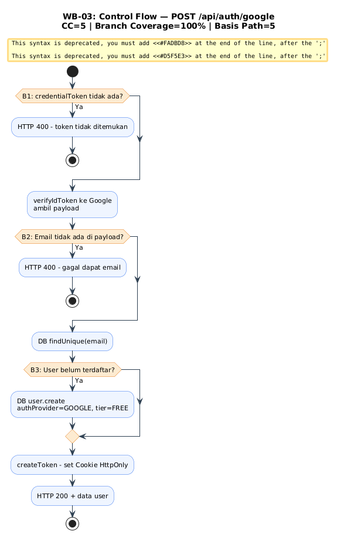

---

## WB-04 — POST /api/auth/forgot-password

**CC = 7 · Branch = 12/12 · Basis Path = 7**

Titik keputusan: rate limit 3x/15 menit, email kosong, format email, user ditemukan, mode dev/prod. Response selalu generik (anti user-enumeration).

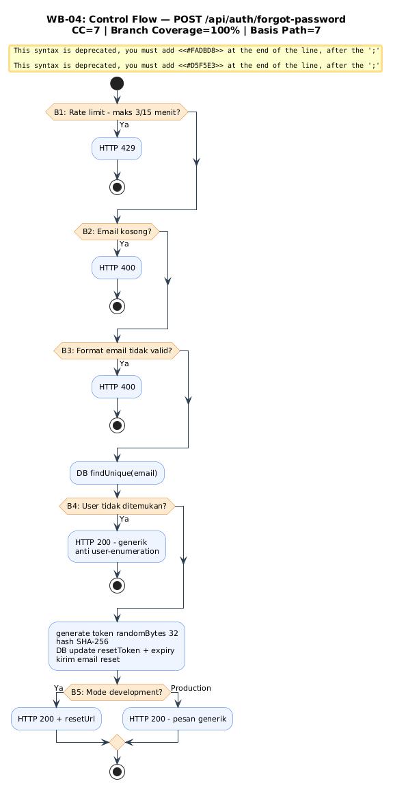

---

## WB-05 — POST /api/auth/reset-password

**CC = 5 · Branch = 10/10 · Basis Path = 6**

Titik keputusan: token/password ada, panjang password, token valid + belum expired (filter di DB query), exception handler.

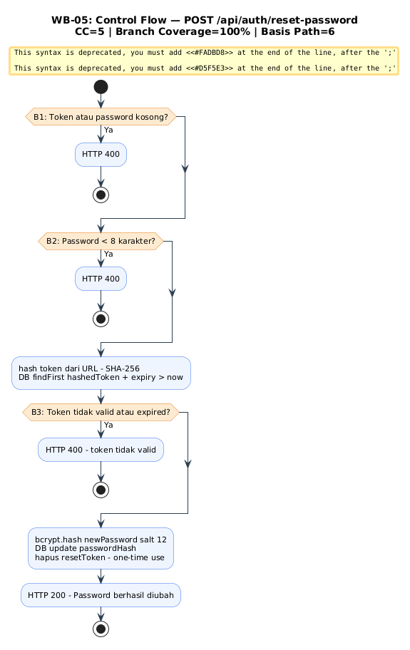

---

## WB-06 — POST /api/logout

**CC = 3 · Branch = 4/4 · Basis Path = 3**

Titik keputusan: sesi Supabase aktif, exception handler. Selalu hapus JWT cookie meski tidak ada sesi Supabase.

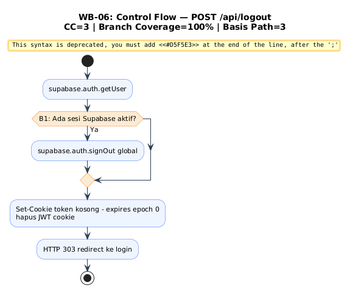

---

## WB-07 — GET /api/profile

**CC = 7 · Branch = 12/12 · Basis Path = 7**

Titik keputusan: token ada, user ada, tier FREE, ada transaksi PENDING, status Midtrans settlement/capture. Fitur self-healing upgrade PRO jika webhook terlambat.

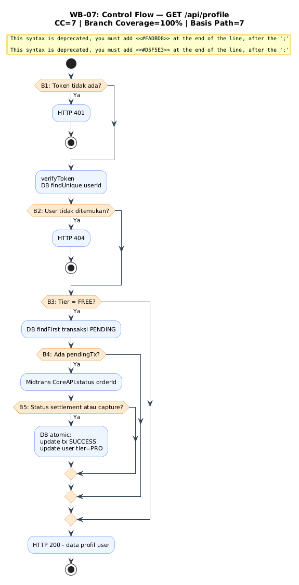

---

## WB-08 — PATCH /api/profile

**CC = 11 · Branch = 18/18 · Basis Path = 10**

Modul paling kompleks. Titik keputusan: token, user ada, avatarUrl format, newPassword ada, currentPassword ada, password cocok, password baru panjang, personalContext ada, panjang 500 char, ada field yang berubah.

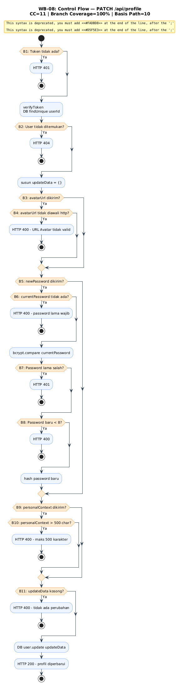

---

## WB-09 — DELETE /api/profile

**CC = 3 · Branch = 4/4 · Basis Path = 3**

Titik keputusan: token ada, exception handler. Cascade delete otomatis Chat, ChatHistory, Transaction, SearchLog.

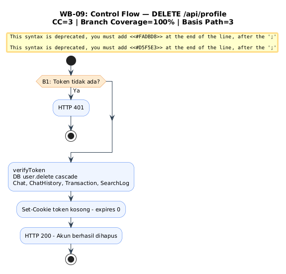

---

## WB-10 — POST /api/chat

**CC = 11 · Branch = 20/20 · Basis Path = 9**

Modul paling kompleks. Titik keputusan: sesi JWT, pesan kosong, user ada, limit FREE, personalContext, LLM quota, LLM error, chatId ada, chatSession ditemukan.

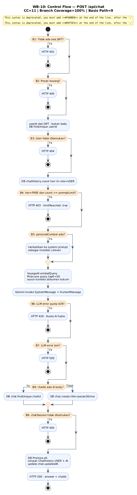

---

## WB-11 — GET /api/chat

**CC = 6 · Branch = 10/10 · Basis Path = 6**

Titik keputusan: sesi valid + userId cocok (IDOR), type=list, chatId ada, fallback legacy, exception handler.

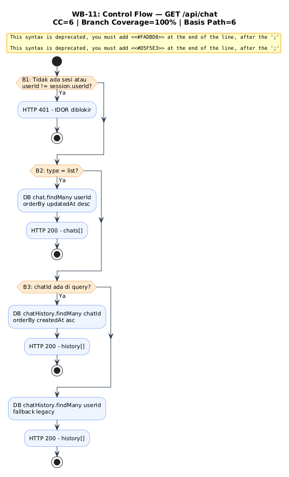

---

## WB-12 — PATCH /api/chat

**CC = 5 · Branch = 8/8 · Basis Path = 5**

Titik keputusan: sesi ada, data lengkap, ownership check (chat milik sendiri), exception handler.

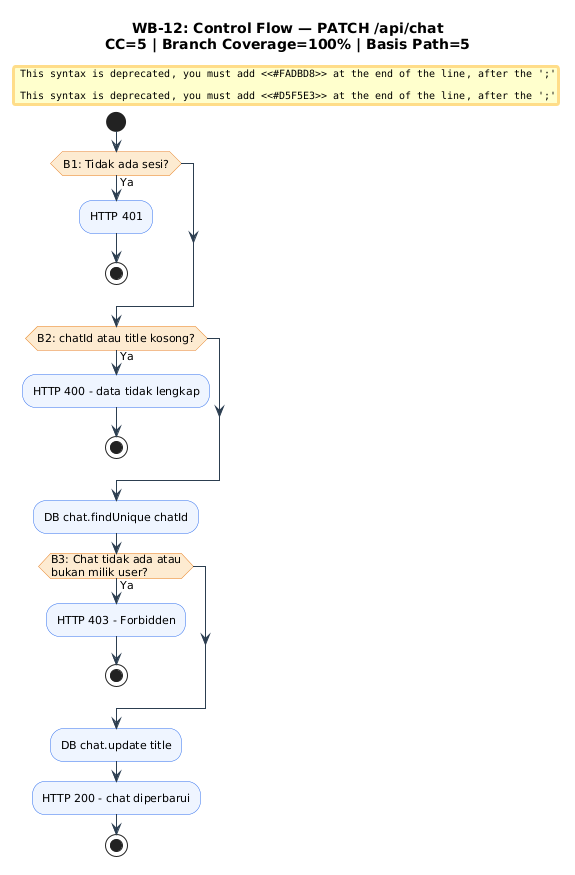

---

## WB-13 — DELETE /api/chat

**CC = 5 · Branch = 8/8 · Basis Path = 5**

Titik keputusan: sesi ada, chatId ada, ownership check, exception handler. Cascade delete ChatHistory otomatis.

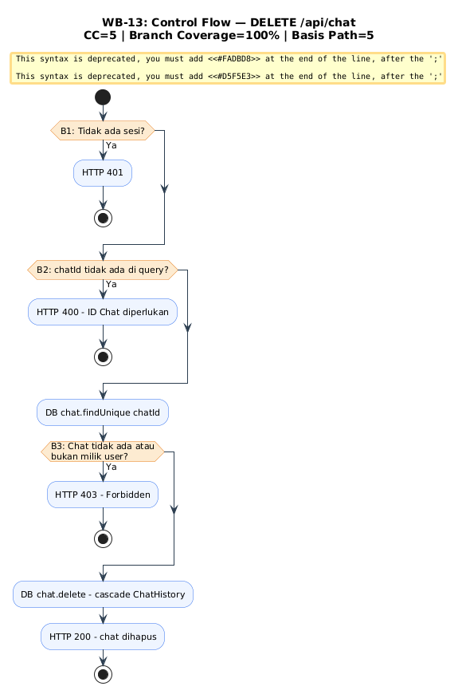

---

## WB-14 — GET /api/regulations

**CC = 5 · Branch = 8/8 · Basis Path = 6**

Titik keputusan: search ada (log ke SearchLog async), search filter, category filter, NaN fallback page=1, exception handler.

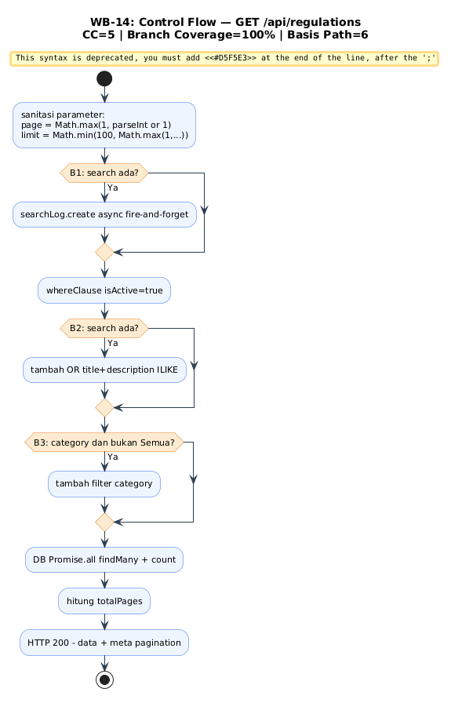

---

## WB-15 — GET /api/regulations/[id]

**CC = 5 · Branch = 8/8 · Basis Path = 5**

Titik keputusan: id ada, regulasi ditemukan, viewCount update (fire-and-forget boleh gagal), exception handler.

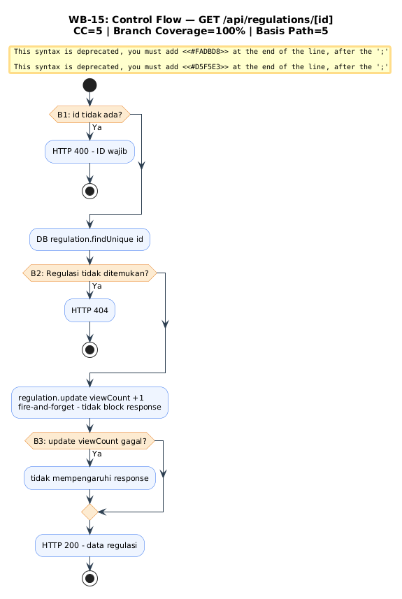

---

## WB-16 — GET /api/regulations/download

**CC = 7 · Branch = 12/12 · Basis Path = 6**

Titik keputusan: url ada, URL bisa di-parse, domain supabase.co (SSRF guard), upstream OK, exception handler.

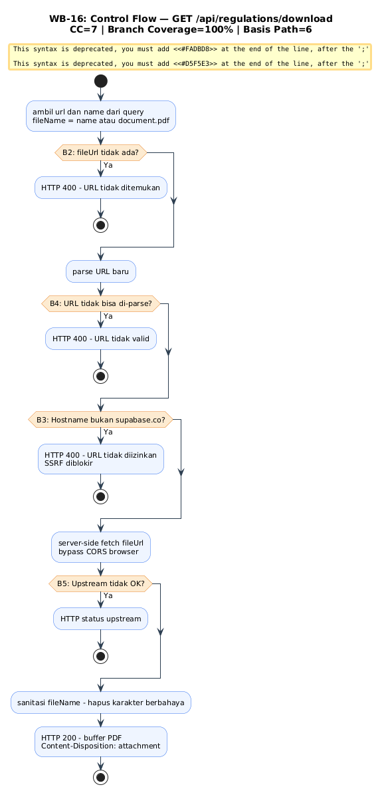

---

## WB-17 — GET /api/dashboard

**CC = 4 · Branch = 6/6 · Basis Path = 4**

Titik keputusan: sesi ada, cache hit (TTL 30 detik), exception handler. Jika cache miss — 6 query paralel ke DB.

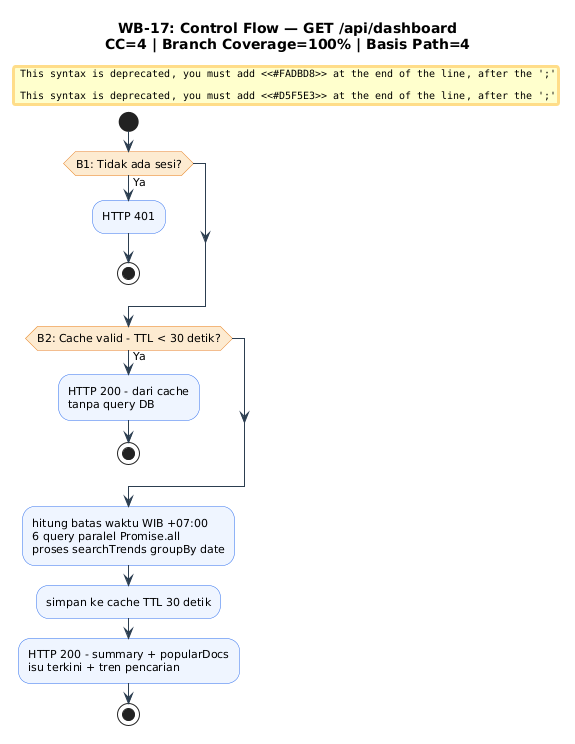

---

## WB-18 — POST /api/payment/checkout

**CC = 5 · Branch = 8/8 · Basis Path = 5**

Titik keputusan: userId ada, user ditemukan, tier sudah PRO (blokir double payment), exception handler (Midtrans down).

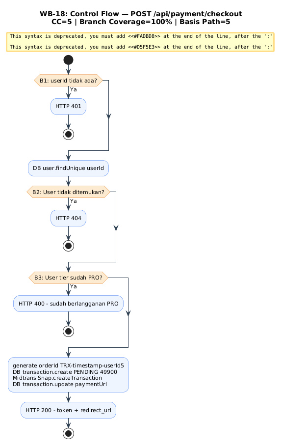

---

## WB-19 — POST /api/payment/webhook

**CC = 10 · Branch = 18/18 · Basis Path = 10**

Titik keputusan: mode production (validasi SHA512), signature cocok, capture/settlement, fraud=challenge, cancel/deny/expire, transaksi ada, sudah SUCCESS (idempotency), finalStatus SUCCESS.

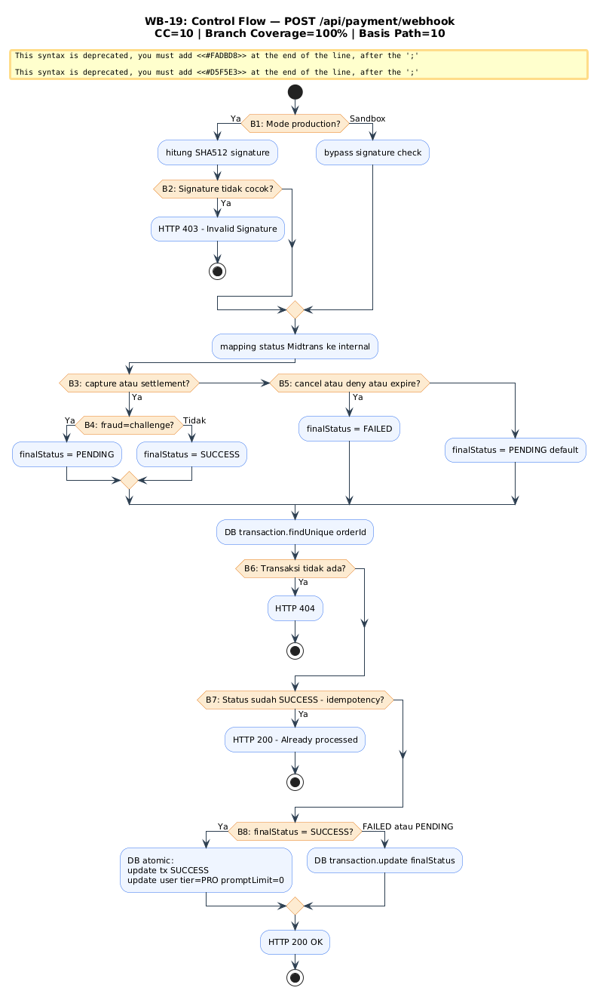

---

## WB-20 — middleware.js

**CC = 6 · Branch = 10/10 · Basis Path = 6**

Titik keputusan: path /api/admin, token ada, JWT_SECRET di-set (fail-closed), role ADMIN, token valid, exception (token palsu/expired).

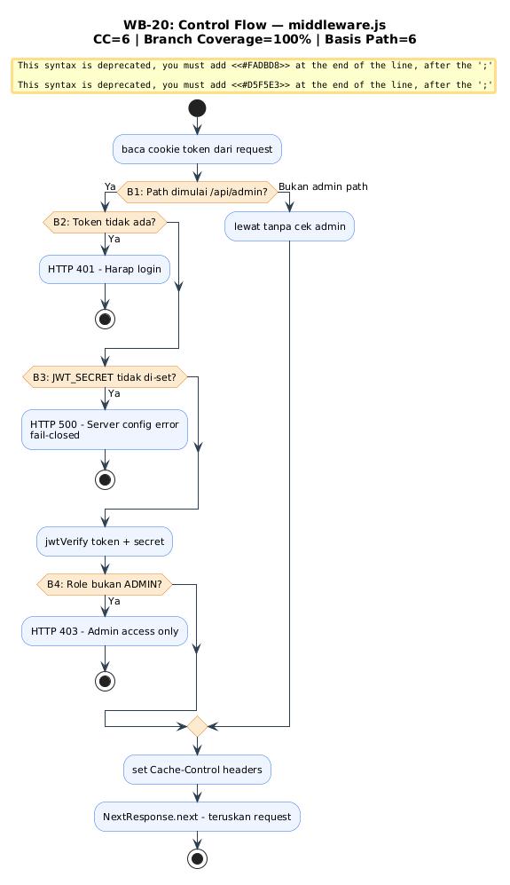
